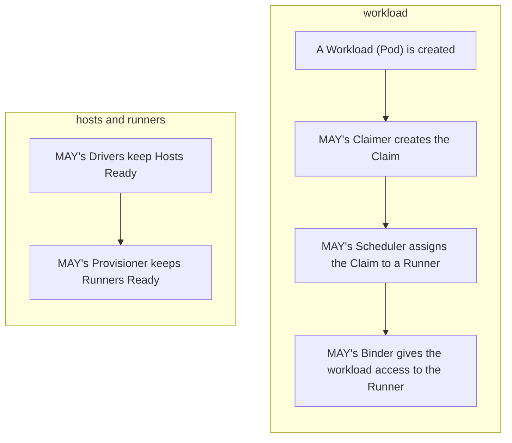

# MAY — Multi-Architecture Y?

MAY is a Kubernetes-native system for management of remote multi-architecture runners.
It schedules workloads onto remote runners, provisions and scales runners as needed, and cleans up when task finish.
Developers define Pods; MAY handles the multi-architecture and remote-runner complexity.

It's designed to support konflux-ci's needs for multi-architecture tasks and to integrate with Kueue and Tekton.
MAY provides native integration with Pods.

## What MAY Does

- **Schedules workloads** onto available runners via Kueue and MAY’s own scheduling
- **Provisions runners** on static or dynamic hosts (e.g. cloud instances)
- **Binds workloads to runners** and provides secure access (e.g. OTP-based SSH)
- **Integrates with Tekton and Kueue** so pipelines and queues stay the main interface

You get multi-arch builds (e.g. AMD64 and ARM64) without managing runner infrastructure yourself.

## Concepts

| Resource   | Description |
|------------|-------------|
| **Claim**  | A request for a runner, tied to a workload (e.g. a Tekton Task’s Pod). |
| **Runner** | A build environment with a given flavor and resources. |
| **Host**   | A machine (physical or virtual) that runs Runners. **StaticHost**: fixed set of runners. **DynamicHost**: one runner per host, created on demand. |

## High Level Flow



## Component Overview

### MAY (may/)

Defines Claim, Runner, and the abstract Host contract; host implementation is delegated to **drivers**.

Single controller with multiple reconcilers
* **Claimer**: create Claims for workloads.
* **Gater**: admission/flow control. Prevents Pods from being scheduled until their Claims are bound.
* **Scheduler**: assign Claims to Runners.
* **Binder**: Runner credentials / binding.
* **Provisioner**: Runner lifecycle on Hosts.

### In-Cluster Driver (drivers/incluster/)

> :warning: It's is a demo driver. It's NOT for production use. Use it for local development, demo, or test purposes only. :warning:

Implements Hosts inside the cluster by reconciling **StaticHost** and **DynamicHost**.
Other drivers could implement cloud or external hosts.

## Project Status

This is a **proof of concept**. Core scheduling, binding, and host/runner lifecycle work, but expect:

- Possible breaking API and behavior changes
- Missing features and edge-case handling
- Future performance and scalability work
- Incomplete or evolving documentation

## Repository Layout

```
may/
├── may/                        # Core MAY controller (claimer, scheduler, binder, provisioner, gater)
│   ├── api/                    # CRDs: Claim, Runner, Host (shared), StaticHost, DynamicHost, …
│   ├── internal/controller/    # MAY controllers
│   └── config/                 # Kustomize for deploying MAY
├── drivers/incluster/          # In-cluster host driver: reconciles StaticHost and DynamicHost
└── demo/                       # End-to-end demo
    ├── hack/setup-cluster.sh   # Kind cluster + Kueue, Tekton, MAY, incluster driver
    ├── config/
    │   ├── cohorts/            # Kueue cohorts and resource flavors
    │   ├── static/             # StaticHosts and sample PipelineRuns (e.g. ARM64)
    │   └── dynamic/            # DynamicHost provider and sample PipelineRuns (e.g. AMD64)
    └── dependencies/           # Kueue, Tekton-Kueue, cert-manager, OTP server, etc.
```

### Demo (demo/)
The [demo/](./demo) folder contains a Kind-based environment with Kueue, Tekton, Tekton-Kueue, MAY, and the incluster driver, plus sample cohorts, hosts, and PipelineRuns for static and dynamic flows.

## Prerequisites

- **Go 1.24+**
- **Docker** (or another container runtime)
- **kubectl**
- **Kind** (for the demo cluster)

## Quick Start (Demo)

From the repo root:

```bash
./demo/hack/setup-cluster.sh
```

> :warning: The script invokes `kind` and then use `kubectl`'s global context.

The script will:

1. Create a Kind cluster `mpc-v2-poc`
2. Install cert-manager, Tekton Pipelines, Kueue, Tekton-Kueue
3. Install the MAY controller and the incluster driver

### StaticHost

Create the StaticHost

```bash
kubectl apply -k demo/config/static/hosts/arm64
```

Create the sample PipelineRuns

```bash
kubectl apply -k demo/config/static/tenant-pipelinerun-may-static/
kubectl get pipelineruns -A -w
```

### DynamicHost

Create the DynamicHostAutoscaler

```bash
kubectl apply -k demo/config/dynamic/hostautoscaler/amd64
```

Create the sample PipelineRuns

```bash
kubectl apply -k demo/config/dynamic/tenant-pipelinerun-may-dynamic/
kubectl get pipelineruns -A -w
```

## Development

### MAY controller (`may/`)

Run Unit tests

```bash
make -C may test
```

Run e2e tests
```bash
make -C may test-e2e
```

### In-Cluster driver (`drivers/incluster/`)

Run Unit tests

```bash
make -C drivers/incluster test
```

Run e2e tests
```bash
make -C drivers/incluster test-e2e
```
